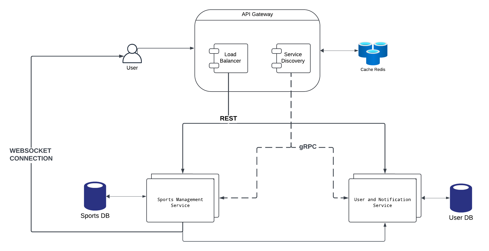

# PAD
>Racovcena Irina, FAF-212

## Running and Deploying 
To run the project install and run Docker. After that run the following commands:

```
docker-compose build
docker-compose up
```

## What are Microservices really all about?

Microservices are an architectural style that structures an application as a collection of loosely coupled, independently deployable services. Each microservice is designed to handle a specific piece of functionality and communicates with other services through well-defined APIs.

Reasons to use microservices:
* Scalability
* Fault Isolation
* Quicker Deployment
* Tech Agnosticity

Building microservices costs much. That's why it makes sense to use them if you have a big system that requires a lot of maintainance and functionality. It enables team independence which can move fast resulting the blast of failures to be well-contained. Each service could be independently designed, deployed, and scaled. 

### Real-life Examples:

- **LinkedIn** - LinkedIn uses microservices to handle different aspects of its professional networking platform, including profiles, messaging, job recommendations, and feed management. Microservices allow LinkedIn to scale specific services based on user activity and needs, improving performance and reliability.

- **PayPal** - PayPal utilizes microservices for processing payments, managing user accounts, handling transactions, and fraud detection.

- **Twitter** - Twitter uses microservices to handle various functions such as user management, tweet storage, notifications, and search.

## Application Suitability
**Live Sport Update Platform** is an application for all sport fans who are willing to be aware of all important incoming games from Australian Open to Euro Cup. This app is focused to on providing real-time sports updates allowing users to stay informed about ongoing games, scores, and other relevant information regarding statitisc and comments on the selected sport event. 

The idea of a Live Sports Update Platform is highly relevant due to the increasing demand for real-time sports information and the growing number of sports enthusiasts who expect timely updates. **High volume data** is another reason because data is sourced from various channels, such as sports APIs, which require efficient handling and integration. **Customization and personalization** are another necessity of a modern user. Features like real-time chatrooms or forums can be implemented using distributed systems enhance **user experience**. Also, distributed systems can efficiently integrate with various external sports data APIs, ensuring comprehensive coverage and up-to-date information and **technology flexibility**. 

Benefits of using microservices:

Of course it's **user managemenet** because Users can sign up, log in, and manage their profiles setting preferences for teams, sports. Customizable **subscriptions** to specific teams or matches to receive targeted updates.Moreover, **WebSocket-Based Forums** where users can interact in real-time through a chatroom or forum dedicated to ongoing games or sports discussions. 

Future expansion:
- Social Media Integration
- Interactive Features such as polls, quizzes, and interactive content related to ongoing events.
- Notification system
- Betting Odds
- AI-driven voice insights and recommendations for users
- Event and Venue Information

Similar projects:
* ESPN
* Bleacher Report
* Sofascore

## Service Boundaries




**User and Notification Service** focuses on managing user accounts, authentication, and delivering notifications.

**Sports Management Service** manages sports event data, including ongoing games, scores, and analytics. It also supports features related to sports discussions and provides users with real-time information about sports events.

## Technology Stack and Communication Patterns
Microservice A: Sports Management Service

    Backend: Python Flask
    Chatrooms: WebSocket 
    Data Processing: Redis

Microservice B: User and Notification Service

    Backend: Python Flask
    Database: MongoDB

API Gateway:

    Express

Inter-service communication:

    RESTful APIs (CRUD), WebSocket and gRPC (service discovery)

## Data Management
### Sports Management Service

Post an event - Post a new event with related details. This is the entry point for the sport service, as all other endpoint imply the existance of at least one event.
    
    Endpoint: POST /api/sports/events
    Request Body: json
```
{
  "event_id": "string",
  "sport_category": "string",
  "team_1": "string",
  "team_2": "string",
  "score_team_1": int,
  "score_team_2": int,
  "event_status": "string"
}
```

Response Format: json

```
{
  "event_id": "string",
  "message": "Event added",
  "status": "success"
}
```

Data of Ongoing Events - Retrieves data on all currently ongoing sports events.

    Endpoint: GET /api/sports/ongoing-events
    Request Parameters: None
    Response Format: json

```
{
    "data": [
        {
            "score_team_1": int,
            "score_team_2": int,
            "sport_category": "string",
            "team_1": "string",
            "team_2": "string"
        }
    ],
    "status": "success"
}
```

Choose Category of Sport - Retrieves a list of available sport categories.

    Endpoint: GET /api/sports/categories
    Request Parameters: None
    Response Format: json

```
{
  "status": "success",
  "data": [
    {
      "category_id": "string",
      "category_name": "string"
    }
  ]
}
```

Score of a Certain Game - Retrieves the current score and details for a specific game.

    Endpoint: GET /api/sports/games/{game_id}
    Request Parameters: game_id (path parameter)
    Response Format: json
```
{
  "data": {
      "game_id": "string",
      "score_team_1": int,
      "score_team_2": int,
      "status": "string",
      "team_1": "string",
      "team_2": "string"
  },
  "status": "success"
}
```

Join Chatroom - Allows a user to join a discussion chatroom related to a specific game or sport.

    Endpoint: ws://localhost:3000/ws
    Request Body:json

```
{
  "user_id": "string", 
  "content": "string"
}
```

### User and Notification Service

User Registration - Registers a new user. This has to be the first endpoint requested as all other endpoint manipulate with user data.
        
    Endpoint: POST /api/users/register
    Request Body:json

```
{
  "username": "string",
  "password": "string",
  "email": "string"
}
```

Response Format:json

    {
      "status": "success",
      "message": "Registration successful"
    }

User Login - Authenticates a user and provides a token. This is the second endpoint as it generates a token needed for all other endpoints.

    Endpoint: POST /api/users/login
    Request Body:json

```
{
  "username": "string",
  "password": "string"
}
```

Response Format:json

```
{
  "status": "success",
  "token": "string"
}
```

Get me - fetch authorized user profile details


    Endpoint: GET /api/users/me
    Request Body: None
    Response Format:json

```
{
    "data": {
        "email": "string",
        "user_id": "string",
        "username": "string"
    },
    "status": "success"
}
```

Update Notification Preferences - Updates notification preferences for a user.

    Endpoint: PUT /api/users/preferences/notifications
    Request Body: json

```
{
  "email_notifications": boolean,
  "sms_notifications": boolean
}
```

Response Format: json

    {
      "status": "success",
      "message": "Notification preferences updated"
    }


## Deployment & Scaling
Docker (containerization), Docker Compose (running multi-container applications)


## Uptated Service Boundaries Diagram:

Here's the new Architecture Diagram of the System:


**High availability** is ensured across multiple components, including caching, databases, and the ELK stack, with redundancy and fault-tolerance mechanisms in place.

The architecture includes an **ELK Stack (Elasticsearch, Logstash, and Kibana)** for logging and aggregation. It aggregates logs from all services, providing a centralized logging system for monitoring and troubleshooting.

**Consistent hashing** is applied to the Redis Cache layer, allowing data distribution across multiple cache nodes, which aids in cache scalability and fault tolerance.

The **Redis Cache** is configured with high availability, ensuring that cache data remains accessible even if individual cache nodes fail. This setup helps in maintaining system performance.

Instead of strict 2-Phase Commits for all transactions, **Saga transactions** are implemented to handle long-running workflows. The Saga Coordinator orchestrates these transactions, providing eventual consistency and handling compensating actions in case of partial failures.

The User Database is set up in a master-replica configuration, with one master and two replicas **(User DB Master, User DB 1, User DB 2)**. This setup provides redundancy and ensures high availability by enabling failover if the master node fails.

A **Data Warehouse** is included in the architecture. Data is periodically updated from the operational databases to the warehouse via an ETL (Extract, Transform, Load) process, with a Staging Area serving as a buffer. This setup allows for efficient data analysis and reporting without impacting the primary databases.